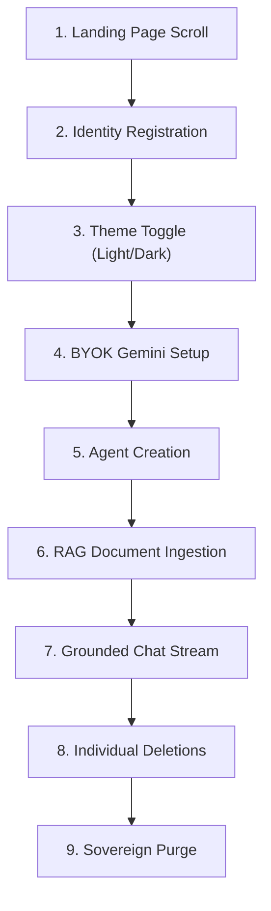

# 🧠 AgentForge Sovereign E2E Recording Walkthrough

This document provides a technical walkthrough of the **Sovereign E2E Exhaustion Matrix** designed for **AgentForge**. It outlines the stages executed by the test automation, the selectors used, and the system design principles that govern the user flows.

---

## 🏗️ The E2E Flow Diagram

The test suite in [recording.spec.ts](./recording.spec.ts) validates the entire system flow sequentially to ensure layout stability and RAG correctness across multiple viewports (Desktop, Tablet, and Mobile).



---

## 📝 The 9-Stage Lifecycle Sequence

### 1. Landing Page Verification & Scroll
* **Objective:** Verify the premium landing page layout, responsive design, and branding copy.
* **Mechanism:** Checks for key elements like `"AgentForge"` and `"Build Autonomous AI Agents"`. Triggers a smooth scroll to showcase CSS animations and neural constellation effects, then scrolls back to the top.

### 2. Identity Registration
* **Objective:** Initialize a secure workspace session.
* **Mechanism:** Generates timestamped credentials (`demo_${timestamp}_viewport@forge.test`) to prevent database collisions, fills in fields `#register-name`, `#register-email`, `#register-password`, `#register-confirm`, and clicks **Create Account**. Verifies redirect to `/dashboard`.

### 3. Theme Toggle — Light & Dark Mode
* **Objective:** Validate the Sovereign Theme & Contrast Architecture (U8).
* **Mechanism:** Clicks `#theme-toggle-btn` to switch to Light Mode, asserts `data-theme="light"` on `<html>`, pauses to showcase the light design, then toggles back to Dark Mode and asserts `data-theme="dark"`. Ensures no FOUC (Flash of Unstyled Content) occurs thanks to the blocking `<script>` in `layout.tsx`.

### 4. BYOK — Configure Gemini API Key
* **Objective:** Anchor custom LLM API parameters using secure client-side setup.
* **Mechanism:** Navigates to `/settings` via sidebar, inputs the Zod-validated `GEMINI_API_KEY` (fetched dynamically from the backend `.env`), selects the `gemini-2.5-flash` model, and saves. Verifies that the status indicator updates to `.key-status-indicator.active`.

### 5. Create Autonomous Agent
* **Objective:** Build an autonomous agent with a custom system persona.
* **Mechanism:** Navigates back to Dashboard via sidebar, clicks **New Agent**, populates fields in the modal form (Agent Name, System Prompt, and Temperature slider), and submits. Verifies the new agent card renders correctly in the grid via `.agent-card` selector.

### 6. RAG Document Ingestion & Vectorization
* **Objective:** Ground the agent's knowledge base using external documents.
* **Mechanism:** Clicks the agent card's **Data** button to access `/agents/[id]/knowledge`. Creates a temporary local text file and uploads it using Playwright's `setInputFiles` API. Verifies the file appears in `.doc-row` after the vectorization pipeline completes.

### 7. RAG Chat — Grounded Query & Stream Verification
* **Objective:** Verify real-time semantic retrieval and streaming LLM responses.
* **Mechanism:** Navigates to `/chat/[id]`, sends a targeted question about the uploaded document (`"Who is Antigravity according to the protocol?"`), and verifies that the model retrieves the context and replies with grounded answers containing `"antigravity"`.

### 8. Individual Item Deletions with Assertions
* **Objective:** Verify individual CRUD deletion operations and empty-state rendering.
* **Mechanism:**
  1. **Delete Document:** Returns to the Knowledge page, clicks `button[title="Delete document"]`, verifies the `.doc-row` disappears.
  2. **Delete Agent:** Returns to the Dashboard, clicks `button[title="Delete Agent"]` on the agent card, verifies the card disappears.

### 9. Sovereign Purge — Account Vaporization
* **Objective:** Verify compliance with the Sovereign Purge requirement (absolute data privacy).
* **Mechanism:** Returns to `/settings`, triggers **Vaporize Account**, intercepts the browser's native `confirm` modal to accept, and verifies redirection back to `/login` with all session credentials deleted.

---

## 📐 Multi-Viewport Matrix

| Viewport | Width | Height | Sidebar Behavior |
|----------|-------|--------|-----------------|
| Desktop  | 1440  | 900    | Always visible  |
| Tablet   | 768   | 1024   | Burger menu     |
| Mobile   | 375   | 812    | Burger menu     |

The test uses a `navigateSidebar()` helper that automatically detects `button.btn-menu` visibility and opens the mobile overlay before clicking navigation links. This ensures identical test logic works across all viewports.

---

## 🔐 Security & Configuration

> [!IMPORTANT]
> **Key Encryption:** All user API keys (e.g., Google Gemini keys) entered during settings configuration are encrypted at rest using AES-256-GCM before writing to the PostgreSQL database.

> [!NOTE]
> **Anti-FOUC Blocking Script:** The `layout.tsx` includes a synchronous `<script>` in `<head>` that reads `localStorage` and sets `data-theme` on `<html>` before React hydrates. This eliminates the light-mode flash that would otherwise occur during page transitions. The `ThemeContext.Provider` always wraps children (never conditionally bypassed) to prevent SSR build crashes.

> [!TIP]
> **Headed Recording:** To record a video demo with a visible browser window, run:
> ```bash
> cd frontend
> HEADED=1 npx playwright test
> ```
> On Windows PowerShell:
> ```powershell
> cd frontend
> $env:HEADED=1; npx playwright test
> ```
